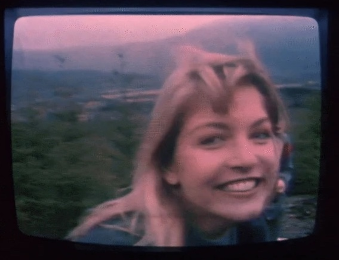
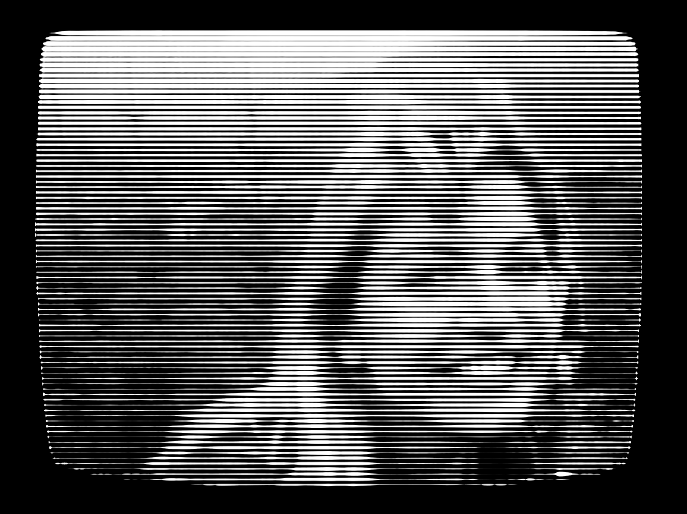
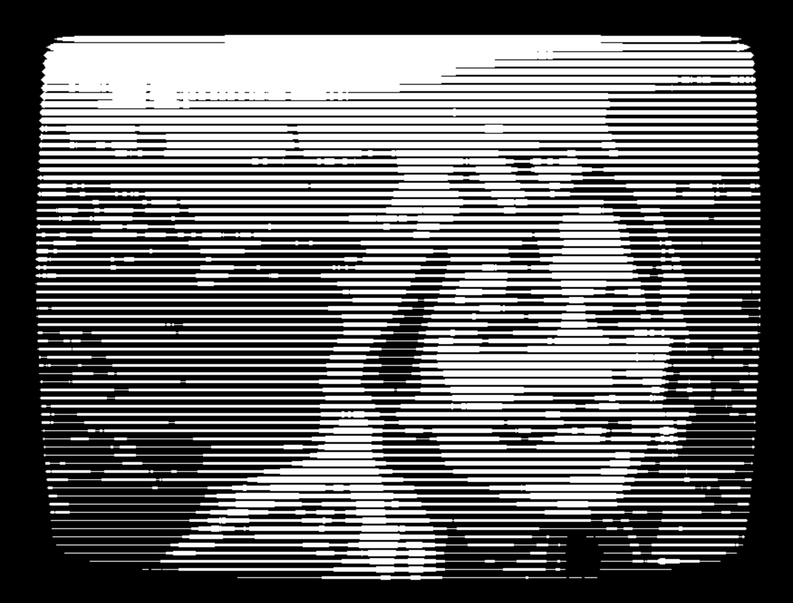
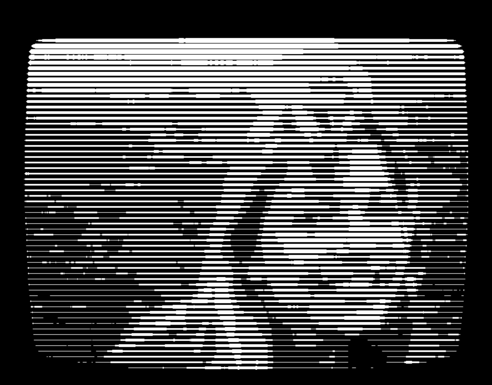
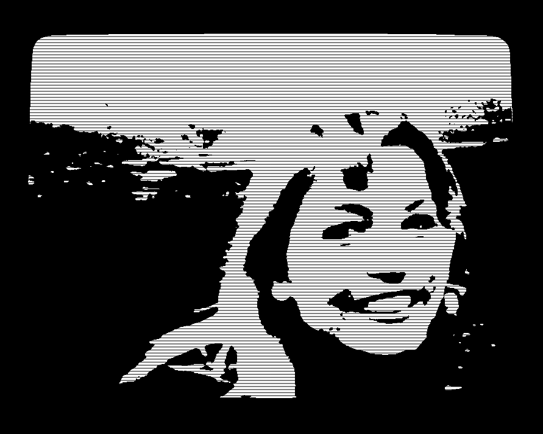
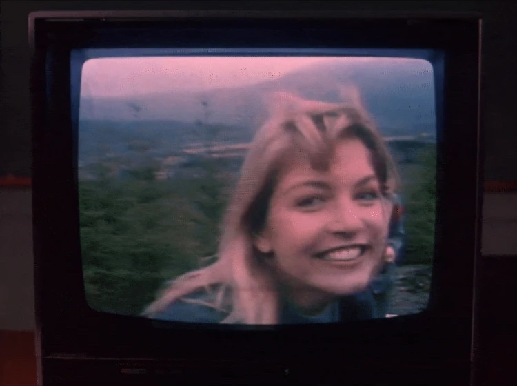

# laura_palmer
Processing program to generate scan-line style artwork from an image.

Turn this:


Into this:


## Usage

1. Install Processing from https://processing.org/download/
2. Open `laura_palmer.pde` in the Processing IDE.
3. Run the sketch.

### How it works

Given a loaded image, the program loads it as greyscale and then iterates through the pixels in rows of a set number of pixels high. For each row, it takes vertical slices of pixels and evaluates the average brightness of each slice, then draws a white bar, centered on the row, with a height proportional to the brightness of that slice. The result is a set of scan lines, where brighter areas have thicker lines and darker areas have thinner lines.

#### Examples

Here are some examples of the effect with different settings:

lpalmer.png, with `modGap=0`, `threshold=40`, `lineAmplitude=4`, `lineGap=0`:
<table>
  <tr>
    <td></td>
    <td>Fairly low threshold and no gap, means that there are some areas that are fully white.</td>
  </tr>
</table>

---

lpalmer.png, with `modGap=0`, `threshold=125`, `lineAmplitude=4`, `lineGap=1`:

<table>
  <tr>
    <td>Medium threshold and a small gap, with thicker lines. A higher line amplitude means, a smaller number of lines, so might seem like lower 'resolution', but it also has a higher range of line thicknesses.</td>
    <td></td>
  </tr>
</table>

---

lpalmer.png, with `modGap=5`, `threshold=107`, `lineAmplitude=0`, `lineGap=0`:

<table>
  <tr>
    <td></td>
    <td>0 line amplitude, and no line gaps, so this would be just plain black and white. The modGap setting just adds a regular pattern of black lines.</td>
  </tr>
</table>


### Controls

Creating an effect is more art than science. Fiddle with the controls to find something that feels right to you.

- `Load Image` lets you choose any local image and re-render the scanline effect.
- `modGap` If > 0, this inserts a black line every `modGap` lines. You might not want this at all, but it can create some interesting effects.
- `threshold` controls the brightness threshold for determining whether a pixel group is white(255). If the average brightness of a pixel group is above the threshold, it will be considered white.
- `lineAmplitude` controls the max height of each white scanline. Note this is the distance from the center of the line to the top, so the total height of the line will be `lineAmplitude * 2`.
- `lineGap` controls extra spacing between scanlines.


## p5.js browser version

A browser-compatible port is included in `p5js/`.

### Run

1. Start a local web server from the project root.
2. Open `p5js/index.html` through that server.

Example using Python:

```bash
python3 -m http.server 8000
```

Then open:

```text
http://localhost:8000/p5js/
```

# Why Laura Palmer?

I was originally inspired by this iconic freeze frame on a CRT screen in the pilot episode of Twin Peaks:



and wanted to create a physical print with more stylized CRT-like scan lines. I imagine it's _possible_ that you could find a better source image, but I haven't thought of it yet.
